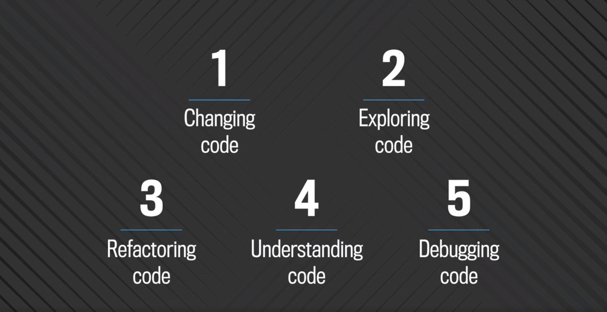

# How Facebook uses code search

> NOTE: There isn't much public information about Facebook's TBGS/BigGrep. If you know more, please contribute to this page!

Facebook uses TBGS ("The Big Grep Search", a.k.a. BigGrep) for code search. Since ~2013, it has been used daily by almost every Facebook employee who interacts with code.

In 2017, Facebook engineer Jeroen Vaelen gave a talk [Searching through code at scale](https://www.facebook.com/atscaleevents/videos/dev-tools-scale-searching-through-code-at-scale-jeroen-vae/1911812842425144/) about how TBGS/BigGrep works and how devs use it. Here's how Jeroen summarizes the use cases:

1. Changing code
1. Exploring code
1. Refactoring code
1. Understanding code
1. Debugging code

A Facebook engineer also tweeted about TBGS:

<blockquote class="twitter-tweet">
tbgs is the StackOverflow for Facebook engineers.
&mdash; Chang Yan (@cyan_binary) <a href="https://twitter.com/cyan_binary/status/1015015559115653121?ref_src=twsrc%5Etfw">July 5, 2018</a></blockquote> 