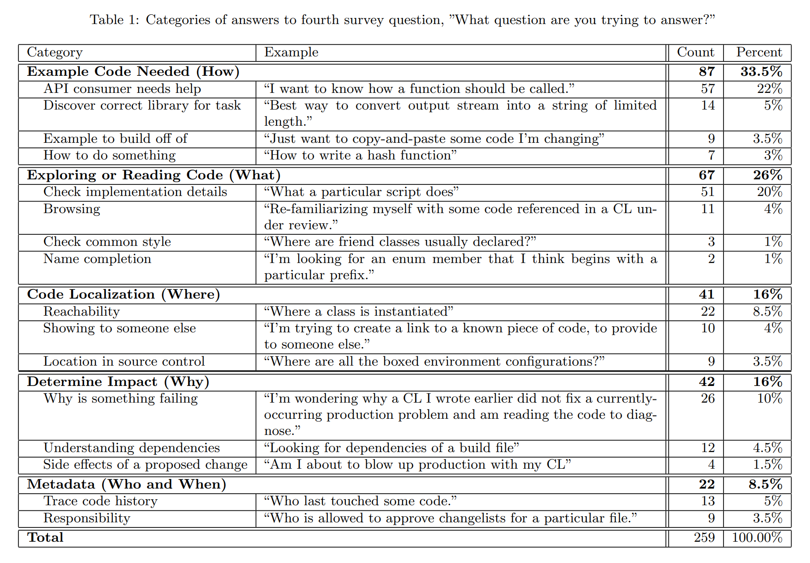
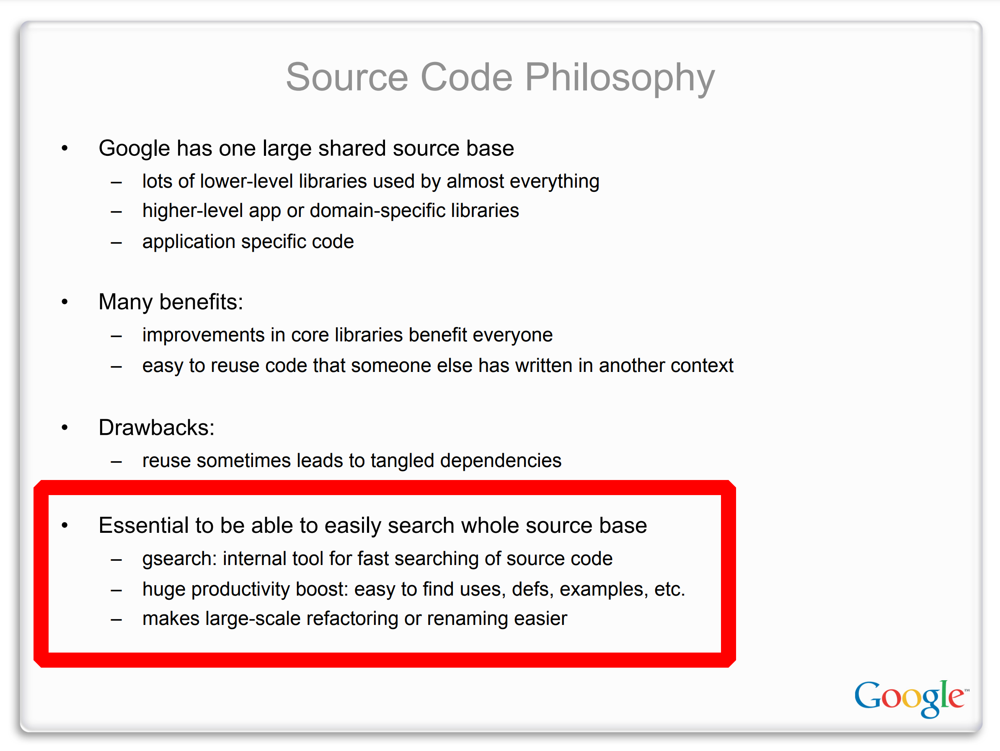

# How Google uses code search

Google developers use CodeSearch, an internal code search tool. They also run public instances of CodeSearch (with some functionality missing) for the [Chromium and Android](chromium-android.md) open-source projects, which anyone can try.

[Caitlin Sadowski](https://research.google/people/CaitlinSadowski/), a Google software engineer and researcher, led a public study of how Google developers use their internal CodeSearch tool: [How Developers Search for Code: A Case Study](https://static.googleusercontent.com/media/research.google.com/en//pubs/archive/43835.pdf).

> On average, developers compose **12 search queries per weekday** (median is 6) [in 5 sessions]. Compared to previous literature, it would seem that code search is far more common than it once was.
>
> Code search tools are becoming so entrenched in software development that they are used to navigate even through code developers know well.

Here's how the study categorized the ways that Google engineers use code search:

[Jeff Dean](https://research.google/people/jeff/), a Google Senior Fellow and software engineer, gave a [talk at Stanford CS 295](https://static.googleusercontent.com/media/research.google.com/en//people/jeff/stanford-295-talk.pdf) that highlighted the value of code search:

> [It's] essential to be able to easily search [the] whole source … huge productivity boost: easy to find uses, defs, examples, etc.

Jeff Dean also helped create Google's internal code search tool. From [his bio]((https://research.google/people/jeff/):

> While at Google, I've worked on the following projects: ... Some internal tools to make it easy to rapidly search our internal source code repository.
